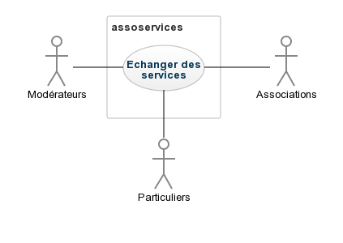

#I	Fondements du projet
##1. But du projet
###a. Problème de l’utilisateur ou contexte du projet

  Grâce à ce projet, nous souhaitons aider les associations à developper leurs projets en les mettant en relation avec les personnes susceptibles de répondre à leurs besoins car nous constatons que celles-ci manquent trop souvent de bénévoles. 

###b. Objectifs du projet

  Nous souhaitons permettre l'échange de services au bénéfice des associations.

##2. Personnes et organismes impliqués dans les enjeux du projet 
###a. Maître d’ouvrage

  L'équipe kouignamann.

###b. Acheteur

  Les associations qui souhaitent développer leurs projets (comme Etudiants Sans Frontières).

###c. Autres parties prenantes

  Non Applicable (N/A)

##3. Utilisateurs du produit
###a.	Utilisateurs directs du produit

  Nous envisageons 10 millions d'associations mais cela peut être très variable et autant de particuliers que de personnes prêtes à aider.
  Le produit doit être accessible pas tous, aussi bien des personnes ayant l'habitude d'utiliser les outils électroniques que les personnes les moins expérimentées. De même, le public sera de tout âge puisqu'il faut attirer un maximum de personnes pour agrandir le réseau d'aide.
  
###b. Priorité assignée aux utilisateurs

  Les associations auront plus de libertés que les particuliers dans le sens ou le produit est à leur bénéfice principal. Elles auront donc un profil et des outils supplémentaires permettant de mettre en avant leur travail associatif.

###c. Implication nécessaire de la part des utilisateurs dans le projet

  Les associations devront mettre à jour régulièrement leur profil si elles veulent pouvoir accroitre leur visibilité et leur attractivité. C'est ensuite à chaque utilisateur de mettre à jour ses propositions et ses demandes de services si il veut pouvoir être aidé.
  En plus des modérateurs, ce sera la responsabilité de chacun de signaler tout comportement abusif ou tout propos diffamatoire.
  
###d. Utilisateurs concernés par les opérations de maintenance du produit

#II	Contraintes sur le projet 
##4. Contraintes non négociables
###a. Contraintes sur la conception de la solution

  La solution doit différencier deux types d'utilisateurs : les associations et les particuliers. En effet, le produit est plus orienté pour les associations et doit donc les mettre plus en avant. Il faut que les particuliers disposent de moins d'outils que les associations.
  La solution doit différencier deux types de profil : celui des associations et celui des particuliers. Les associations doivent avoir la possibilité de se mettre en avant, de se présenter et de rendre compte de leurs activités tandis que les particuliers ne peuvent que présenter leurs propositions d'aide et leurs demandes.

###b. Environnement de fonctionnement du système actuel

  \\ J'y connais rien.

###c. Applications « partenaires » (avec lesquelles le produit doit collaborer)

  Non Applicable (N/A)

###d. « COTS » : Progiciels ou composants commerciaux

  Non Applicable (N/A)

###e. Lieux de fonctionnement prévus

  Partout puisqu'on veut cibler un maximum de personnes.

###f. De combien de temps les développeurs disposent-ils pour le projet ?

  6 mois

###g. Quel est le budget affecté au projet ?

  Entre 10 000 et 20 000 €. 

##5. Glossaire et conventions de dénomination

  Association : membre disposant d'un profil détaillé de ses activités et auquel des particuliers membres peuvent se rattachés.
  Particulier : toute personne ne faisant pas forcément partie d'une association qui désire échanger des services avec une association. Elle dispose d'un profil minimaliste.
  Membre : Tout particulier et association incscrit sur l'application et disposant d'un profil.
  
##6. Faits et hypothèses utiles
###a. Facteurs influençant le produit, mais qui ne sont pas des contraintes imposées sur les exigences
###b. Hypothèses que l’équipe fait sur le projet 
#III	Exigences fonctionnelles
##7. Portée du travail
###a. La situation actuelle
###b. Contexte du travail

  Non Applicable (N/A)

###c. Division du travail en événements métier

  Non Applicable (N/A)

##8. Portée du produit (cas d’utilisations)
###a. Limites du produit : diagramme de cas d’utilisation

  

###b. Description sommaire des cas d’utilisation

  \\Renvoi vers une annexe "liste des exigences qualifiées avec juste les exigences utilisateurs"

##9. Exigences fonctionnelles et exigences sur les données
###a. Exigences fonctionnelles

  \\Renvoi vers une annexe "liste des exigences qualifiées avec juste les exigences fonctionnelles"

#IV	Exigences non fonctionnelles
##10. Ergonomie et convivialité du produit
###a. L’interface
###b. Le style du produit (packaging inclus)
##11. Facilité d’utilisation et facteurs humains 
###a. Facilité d’utilisation

  Le produit doit pouvoir être facile d'accès par n'importe qui : en explorant pendant quelques minutes, l'utilisateur doit comprendre les principales fonctionnalités qui lui sont proposées.
  Le produit doit être intuitif dans son utilisation pour donner envie de revenir et de continuer à l'utiliser.
  Le temps de chargement des pages doit être de quelques secondes et les recherches avec des filtres peuvent prendre un peut plus de temps tant que ça n'excède pas la minute.
  
  Après l'utilisation pour la première fois du produit pendant cinq minutes, l'utilisateur doit être capable d'accéder aux fonctionalités dont on lui parle sans avoir à chercher.
  Un  sondage  anonyme  devrait  montrer  que  90%  des associations utilisent régulièrement le produit après une semaine de familiarisation tandis que 75% des particuliers font de même.
  
###b. Personnalisation et internationalisation

  Le produit doit être disponible en anglais pour permettre un maximum d'échange. Un choix de langue peut être fait par l'utilisateur mais les textes publiées par les associations sur leur profil ne seront pas traduits.
  Un système de suivit des associations doit être disponibles pour les membres, leur permettant d'accéder plus rapidement à ses associations et être tenus au courant de leurs nouveautés.
  Le produit doit se souvenir des dernières recherches faites par un membre et les lui proposer à nouveau. Le membre doit également pouvoir enregistrer quelques recherches par défaut selon des critères spécifiques.
  
###c. Facilité d’apprentissage

  Des petites bulles tutorielles doivent apparaître après l'inscription d'un nouveau membre pour lui présenter toutes les fonctionnalités disponibles. Ce tutoriel intéractif doit pouvoir être passé et son suivi ne doit pas prendre plus de huit minutes.
  
###d. Facilité de compréhension et politesse

###e. Exigences d’accessibilité

##12. Fonctionnement du produit
###a. Rapidité d’exécution et temps de latence

###b. Exigences critiques de sûreté

###c. Précision et exactitude

###d. Fiabilité et disponibilité

###e. Robustesse ou tolérance à un emploi erroné

###f. Capacité de stockage et montée en charge

###g. Adaptation du produit à une augmentation de volume à traiter

###h. Longévité

##13. Adéquation du produit avec son environnement
###a. Environnement physique prévu

###b. Environnement technologique prévu

###c. Applications « partenaires » (avec lesquelles le produit doit collaborer)

###d. Approche « produit » prêt à être commercialisé

##14. Maintenance, support, portabilité, installation du produit
###a. Maintenance du produit

###b. Conditions spéciales concernant la maintenance du produit

###c. Exigences en matière de support

###d. Exigences de portabilité

###e. Installation du système

##15. Sécurité
###a. Accès au système

###b. Intégrité

###c. Protection des données à caractère personnel

###d. Audit et traçabilité

###e. Protection contre les infections

##16. Exigences culturelles et politiques 
###a. Exigences culturelles

###b Exigence politiques

##17. Lois et standards influençant le produit
###a. Conformité avec la loi

###b. Conformité avec des standards

